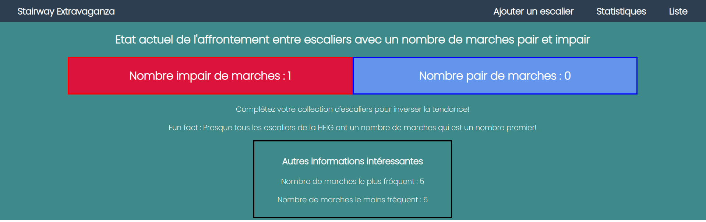

<h1 align="center">
   
  
   
   
</h1>

<h3 align="center">Practical Work 2 - Elliot Ganty</h3>

  <a href="#utilisation">Utilisation</a> •
  <a href="#fonctionnalités-clés">Fonctionnalités clés</a> •
  <a href="#technologies">Technologies</a> •
  <a href="#resources">Resources</a> •

<h2 align="center">Vous comptez les marches quand vous empruntez un escalier ?</h2>

  
Vous détestez les escaliers avec un nombre impair de marches ?

  
Alors vous êtes au bon endroit !

  
Cette application révolutionnaire a pour but d'établir un recensement des escaliers afin d'étudier la répartition du nombre de marches

## Utilisation

Avant de commencer à utiliser cette application dans un conteneur de développement (devcontainer), assurez-vous que votre système dispose des éléments suivants :

**Docker** : doit être installé et configuré sur votre machine. Suivez les instructions pour votre système d'exploitation :

[Installation de Docker pour Windows](https://docs.docker.com/desktop/install/windows-install/)

[Installation de Docker pour macOS](https://docs.docker.com/desktop/install/mac-install/)

[Installation de Docker pour Linux](https://docs.docker.com/engine/install/)

**Visual Studio Code** : Téléchargez et installez Visual Studio Code :

[Télécharger Visual Studio Code](https://code.visualstudio.com/Download)

Je recommande également d'installer cette extension facilitant la gestion des conteneurs de développement :

[Remote - Containers](https://marketplace.visualstudio.com/items?itemName=ms-vscode-remote.remote-containers)

Ouvrir dans un conteneur : 

Lorsque vous ouvrez le dossier du projet dans Visual Studio Code, vous serez invité à ouvrir le dossier dans un conteneur. Cliquez sur l'icône de notification ou utilisez la commande Remote-Containers: Reopen in Container depuis la palette de commandes.

Les dépendances seront automatiquement installées via Composer et l'application sera accessible à l'addresse [localhost:8080](http://localhost:8080)

La base de données est également disponible sur le port 3306. Les informations de connexion sont dans le fichier init.php.

## Fonctionnalités clés

- Vous avez croisé un escalier ? Saisissez le dans l'application ! Un formulaire détaillé vous permettra de le répertorier avec précision !

- Il est possible par la suite de leur attribuer une note et même de créer sa liste de favoris ! Comme ça vous aurez toujours vos escaliers préférés sous la main !

- La liste complète de tous les escaliers explorés est visible en tout temps également comme on le voit ci-dessous.

- Une page de statistique est disponible afin d'évaluer votre collection d'escaliers. Attrapez-les tous !

## Technologies

Base de données: MariaDB

Linter: php_codesniffer

Package Manager: Composer

ORM: Eloquent

## Resources

https://www.readme-templates.com/

https://coolors.co/palette/b4b8ab-153243-284b63-f4f9e9-eef0eb

https://www.canva.com/create/logos/

<a href="https://www.flaticon.com/free-icons/stairs" title="stairs icons">Stairs icons created by Freepik - Flaticon</a>

Image by <a href="https://www.freepik.com/free-vector/gradient-3d-stairs-background_20289308.htm#query=stairs&position=1&from_view=search&track=sph">Freepik</a>