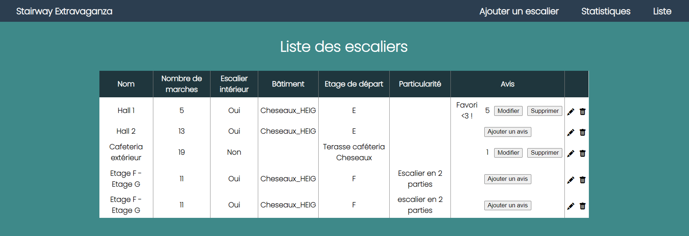
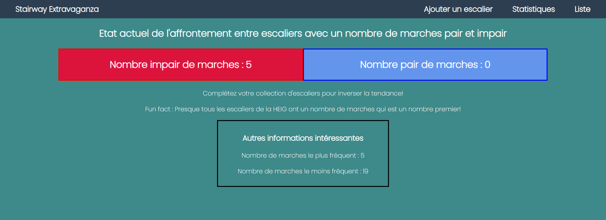

<h1 align="center">
   
  
   
  Stairway Extravaganza
   
</h1>

<h4 align="center">Practical Work 2 - Elliot Ganty</h4>

  <a href="#utilisation">Utilisation</a> •
  <a href="#fonctionnalités-clés">Fonctionnalités clés</a> •
  <a href="#technologies">Technologies</a> •
  <a href="#resources">Resources</a> •

<h2 align="center">Vous comptez les marches quand vous empruntez un escalier ?</h2>

  
Vous détestez les escaliers avec un nombre impair de marches ?

  
Alors vous êtes au bon endroit !

  
Cette application révolutionnaire a pour but d'établir un recensement des escaliers afin d'étudier la répartition du nombre de marches

## Utilisation

Avant de commencer à utiliser cette application dans un conteneur de développement (devcontainer), assurez-vous que votre système dispose des éléments suivants :

Docker : Assurez-vous d'avoir Docker installé et configuré sur votre machine. Suivez les instructions pour votre système d'exploitation :

[Installation de Docker pour Windows](https://docs.docker.com/desktop/install/windows-install/)

[Installation de Docker pour macOS](https://docs.docker.com/desktop/install/mac-install/)

[Installation de Docker pour Linux](https://docs.docker.com/engine/install/)

Visual Studio Code : Téléchargez et installez Visual Studio Code :

[Télécharger Visual Studio Code](https://code.visualstudio.com/Download)

Assurez-vous d'installer les extensions suivantes pour Visual Studio Code, qui sont recommandées pour une expérience de développement optimale avec ce conteneur:

Remote - Containers : Cette extension permet de travailler avec des conteneurs de développement.

[Remote - Containers](https://marketplace.visualstudio.com/items?itemName=ms-vscode-remote.remote-containers)

Ouvrir dans un conteneur : 

Lorsque vous ouvrez le dossier du projet dans Visual Studio Code, vous serez invité à ouvrir le dossier dans un conteneur. Cliquez sur l'icône de notification ou utilisez la commande Remote-Containers: Reopen in Container depuis la palette de commandes.

Les dépendances seront automatiquement installées via Composer et l'application sera accessible à l'addresse
[localhost:8080](http://localhost:8080)

## Fonctionnalités clés

- Ajout dynamique d'escaliers

- Possiblité d'ajouter un avis sur un escalier et sauvegarder certains en favoris

- Répertoire des escaliers recensés

- Etude en temps réel sur les données récoltées

## Technologies

DB: MariaDB

Linter: php_codesniffer

Package Manager: Composer

ORM: Eloquent

## Resources

https://www.readme-templates.com/

https://coolors.co/palette/b4b8ab-153243-284b63-f4f9e9-eef0eb
